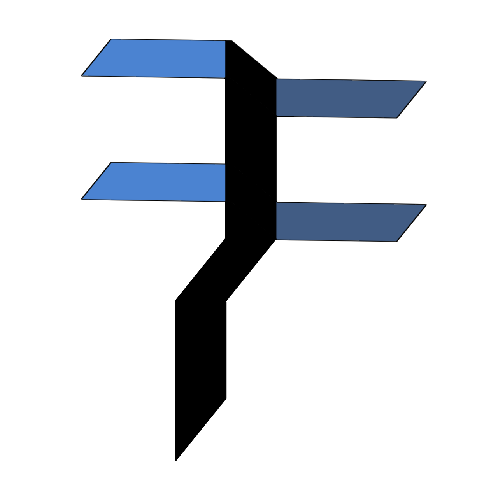

# Ferminal

Ferminal or I like to call it **F*ck Terminal** is a lightweight, Python-based terminal made specifically for Windows users who are tired of typing long commands in Command Prompt or PowerShell. I really hate terminal but like it. I mean,
when you use terminal, u need to write 'dir', 'mkdir', 'clear' when that is suck for me.
and yeah, i made this terminal for more efficient time, but only on windows, sorry '-_-

Instead of writing long commands repeatedly, just use short **custom aliases** that you define yourself.

## Ferminal Documentation
You can see the documentation <a href="https://rangs-1.github.io/Ferminal/documentation 1.0">here</a>